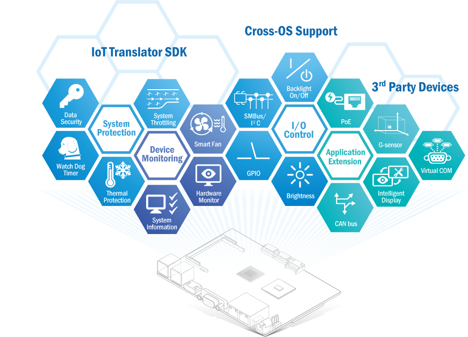

# SUSI APIs (Secure, Unified, and Smart Interface)
## Introduction
As a software developer or system integrator, writing applications requiring direct hardware access can be challenging, especially with modern operating systems. Studying extensive specifications to write appropriate drivers is a complex and time-consuming task.

To simplify this process, Advantech has developed SUSI (Secure and Unified Smart Interface), a suite of Software APIs (Application Programming Interfaces) that bridges the gap between hardware and application implementation efficiency. SUSI provides not only the necessary underlying drivers but also user-friendly, intelligent, and integrated interfaces that accelerate development, enhance security, and offer added value for Advantech platforms.

This allows customers to more easily program and configure features while maintaining full control over their applications. By acting as a catalyst between developers and solutions, SUSI makes Advantech embedded platforms simpler and easier to adopt, improving the overall operation of customer applications.

## Architecture

## Service Highlights

| System Protection | Device Monitoring | I/O Control | Application Extension |
| ----------------- | ----------------- | ----------- | ----------- |
| *Data security  *Watch Dog Timer  *Thermal protection  *System throttling              | *Smart fan  *Hardware monitoring  *System information  *AI information             | *GPIO  *SMBus/I2C  *Backlight on/off  *Brightness  *CANBus | *PoE  *G-sensor  *RAM   *Battery  *Virtual COM |

## Drivers and APIs

### SUSI 4.0
SUSI 4.0 driver supports include not only newer SUSI 4.0 APIs, but also the APIs of SUSI 3.02 and iManager 2.0. Therefore, the old customers, who bought SUSI 3.02 or iManager 2.0 before, can install SUSI 4.0 driver with no effort. Customers will enjoy better performance which is SUSI 4.0 driver carries out.

### SUSI Device
SUSI Device is auxiliary library that depends on SUSI library, making customers access some SMBus devices, such as G-Sensor, RAM, Battery and so on, more efficiently.

### SUSI CANBus
SUSI CANBus API provides customers to manipulate Advantech Embedded Controller functions, including send, receive and set configuration etc.

### SUSI IoT
SUSI IoT is an IoT-oriented library aiming at simplifying the complicated IoT integration developing works. SUSI IoT provides an simple unified interface sets to our users to access various of hardware or software modules.

### SUSI AI
SUSI AI is used to get and set information of AI accelerated devices, such as NVIDIA x86 GPU card, NVIDIA ARM platform, and Intel x86 CPU / GPU; meanwhile, information of docker image and container could be retrieved as well.
